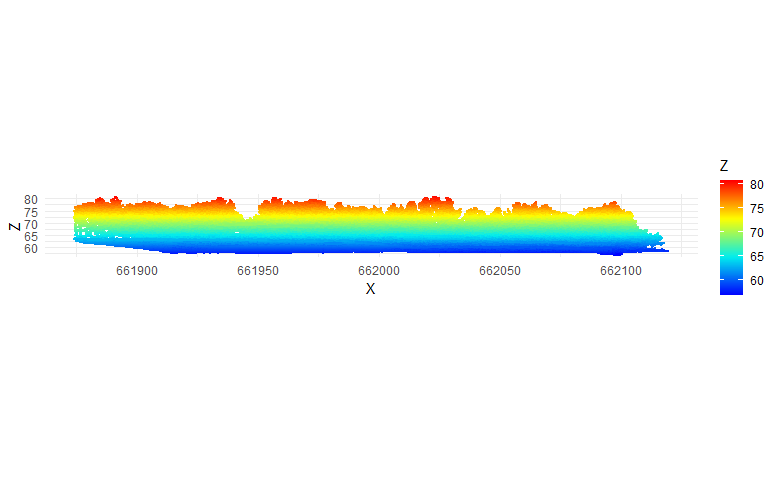

```{r setup, include=FALSE}
knitr::opts_chunk$set(echo = TRUE)
knitr::opts_chunk$set(cache = TRUE)
# Passer la valeur suivante à TRUE pour reproduire les extractions.
knitr::opts_chunk$set(eval = FALSE)
knitr::opts_chunk$set(warning = FALSE)
# pour la 3d du markdown
options(rgl.useNULL = TRUE) # Suppress the separate window.
library(rgl)
```


# Objet

explorer Lidar et R pour les arbres

https://r-lidar.github.io/lidRbook/io.html

et surtout en très clair

https://orbi.uliege.be/bitstream/2268/307897/5/R_GIS_04_lidR.pdf

On cherche d'abord la localisation x y précise des arbres

# Environnement


## Librairies


```{r , eval=TRUE}
library(sf)
library(lidR)
library(rgl)# pour visu 3d
library(mapsf)
library(leaflet)
library(mapview)
```

## Ressources

source : https://whitschroder.github.io/remote-sensing/lidr.html#cloth-simulation-function-csf

https://r-lidar.github.io/lidRbook/dtm.html

traduction rapide du manuel lidR

https://r-lidar.github.io/lidRbook/io.html

donnée position x y z intensité rang angle d'incidence

laz format compressé de las

l'objet est constitué de l'en tête et du nuage de point


## Chemins

Les fichiers de téléchargement sont lourds, on les met dans data/gros
et on modifie le gitignore pour les exclure

Récupération des formes pour couper

```{r, eval=TRUE}
zone <- st_read("data/zone.gpkg")
mapview(zone)
zone <- st_transform(zone, 2154)
```


# Extraction mare à la veuve

```{r}
lasf <- dir("data/gros", "*.laz")
for (f in lasf) {
  las <- readLAS(paste0("data/gros/",f), select = "xyz")
  sel <- clip_roi(las, zone)
  writeLAS(sel, paste0( "data/",f,".las"))
}
```


```{r}
lasf <- dir("data/", "*.las")
sel <- readLAS(paste0("data/", lasf [1]))
sel1 <- readLAS(paste0("data/", lasf [2]))
tot <- rbind(sel, sel1)
writeLAS(tot, "data/gros/tot.las")
```

# présenter


Tous les points sont à zéro

```{r}
tot <- readLAS("data/gros/tot.las")
# tous les points
df <- payload(tot)
table(df$Classification)
```

## vue 2d

```{r, eval=FALSE}
library(ggplot2)
ggplot(payload(tot), aes(X,Z, color = Z)) + 
  geom_point(size = 0.5) + 
  coord_equal() + 
  theme_minimal() +
  scale_color_gradientn(colours = height.colors(50))
```




## rgl


```{r,  eval=TRUE}
tot <- readLAS("data/gros/tot.las")
plot(tot, bg="white")
rglwidget()
```


# Modèle numérique de canopée

On va au plus simple, mais il y a des subtilités par rapport aux données NODATA

```{r, eval=TRUE}
tot <- readLAS("data/gros/tot.las")
library(terra)
chm <- rasterize_canopy(tot, res=1, p2r())
plot (chm)
writeRaster(chm, "data/chm.tif", overwrite=TRUE)
```


# localiser les arbres

on applique un lmf local maximum filter

```{r}
f <- function (x) { x * 0.05 + 2}
ws_args <- list(x ="Z")
ml <- locate_trees(tot, lmf(hmin = 12, f, ws_args = ws_args, shape = "circular"))
plot(chm)
plot(ml$geometry, add = T)
```

points voisins : diametre 7 m semble convenir

```{r, eval=TRUE}
tot <- readLAS("data/gros/tot.las")
chm <- rasterize_canopy(tot, res=1, p2r())
ml <- locate_trees(tot, lmf(ws = 7))
plot(chm)
plot(ml$geometry, add = T)
```

```{r, eval=TRUE}
x <- plot(tot, bf="white", size = 4)
add_treetops3d(x, ml)
rglwidget()
```

# segmentation


permet d'obtenir les arbres individuels


```{r, eval=TRUE}
algo <- dalponte2016(chm, ml)
las <- segment_trees(tot, algo) # segment point cloud
plot(las, bg = "white", size = 4, color = "treeID") # visualize trees
rglwidget()
```


arbre individuel


```{r, eval=TRUE}
tree110 <- filter_poi(las, treeID == 110)
plot(tree110, size = 8, bg = "white")
rglwidget()
```

