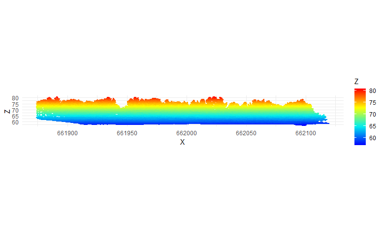

```{r setup, include=FALSE}
knitr::opts_chunk$set(echo = FALSE)
knitr::opts_chunk$set(cache = TRUE)
# Passer la valeur suivante à TRUE pour reproduire les extractions.
knitr::opts_chunk$set(eval = FALSE)
knitr::opts_chunk$set(warning = FALSE)
# pour la 3d du markdown
options(rgl.useNULL = TRUE) # Suppress the separate window.
library(rgl)
rgl::setupKnitr(autoprint = TRUE)
```


# Objet

Présenter les données 3D sur le parc de la mare à la veuve Honorine de Beauvais.

# Environnement


## Librairies


```{r , eval=TRUE}
library(sf)
library(lidR)
library(rgl)# pour visu 3d
library(mapsf)
library(leaflet)
library(mapview)
library(ggplot2)
library(terra)
```


# vue 2d

```{r, eval=FALSE}
tot <- readLAS("data/gros/tot.las")
ggplot(payload(tot), aes(X,Z, color = Z)) + 
  geom_point(size = 0.5) + 
  coord_equal() + 
  theme_minimal() +
  scale_color_gradientn(colours = height.colors(50))
```




# vue 3d


```{r,  eval=TRUE}
tot <- readLAS("data/gros/tot.las")
plot(tot, bg="white")
rglwidget()
```


# Modèle numérique de canopée


```{r, eval=TRUE}
tot <- readLAS("data/gros/tot.las")
chm <- rasterize_canopy(tot, res=1, p2r())
plot (chm)
writeRaster(chm, "data/chm.tif", overwrite=TRUE)
```


# localiser les arbres

on applique un lmf local maximum filter
Un diametre de 7 m semble convenir

```{r, eval=TRUE}
tot <- readLAS("data/gros/tot.las")
chm <- rasterize_canopy(tot, res=1, p2r())
ml <- locate_trees(tot, lmf(ws = 7))
plot(chm)
plot(ml$geometry, add = T)
# graphique
x <- plot(tot, bg="white", size = 4)
add_treetops3d(x, ml)
rglwidget()
```

# segmentation


permet d'obtenir les arbres individuels


```{r, eval=FALSE}
tot <- readLAS("data/gros/tot.las")
chm <- rasterize_canopy(tot, res=1, p2r())
ml <- locate_trees(tot, lmf(ws = 7))
algo <- dalponte2016(chm, ml)
las <- segment_trees(tot, algo) # segment point cloud
plot(las, bg = "white", size = 4, color = "treeID") # visualize trees
#rglwidget()
```


```{r, eval=FALSE}
# arbre individuel
tot <- readLAS("data/gros/tot.las")
chm <- rasterize_canopy(tot, res=1, p2r())
ml <- locate_trees(tot, lmf(ws = 7))
algo <- dalponte2016(chm, ml)
las <- segment_trees(tot, algo) 
tree110 <- filter_poi(las, treeID == 110)
plot(tree110, size = 8, bg = "white")
rglwidget()
```


