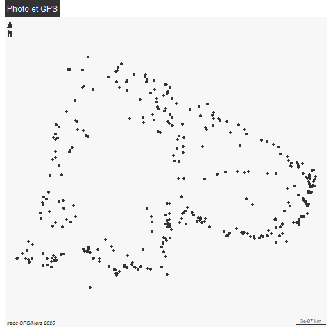

```{r setup, include=FALSE}
knitr::opts_chunk$set(echo = TRUE)
knitr::opts_chunk$set(cache = TRUE)
# Passer la valeur suivante à TRUE pour reproduire les extractions.
knitr::opts_chunk$set(eval = FALSE)
knitr::opts_chunk$set(warning = FALSE)
```


# Objet

Mise en place lien pt GPS et photo essai photographie chambres et pts GPS Pasteur / 14/7

A noter : pb nb photos et nb de points, plusieurs photos pour 1 seul pt


Un article : https://marionlouveaux.fr/fr/blog/gpx-tracks-and-leaflet-interactive-map/#go-to-folding-div permet de faire avec R et Leaflet...


L'objet de ce script est de créer un outil reproductible quelque soit l'objet (d'où les nb chemins)

Les points GPS sont enregistrés dans le GPX
les photos dans photos/ril ou photos/fibre ou etc

# Environnement


## Librairies


```{r , eval=TRUE}
library(dplyr)
#library(ggplot2)
library(leaflet)
library(leafpop)
#library(lubridate)
#library(purrr)
#library(readr)
library(sf)
library(mapsf)
#library(tibble)
library(ggplot2)
library(leaflet)
library(leafpop)
library(lubridate)
library(purrr)
library(readr)
library(sf)
library(mapsf)
library(tibble)
library(tidyr)
library(exiftoolr) # metadonnées photo
library(magick) # pour la taille
```


## Chemins

TO DO nombreux voir invite interactive ?


```{r}
cheminSocle <- "C:/Users/bmaranget/Documents/03_SIG/03_03_Data/03_SOCLE/"
cheminPhoto <- "C:/Users/bmaranget/Documents/03_SIG/03_03_Data/05_PHOTOS/fibre/2025/"
cheminGPX <- "C:/Users/bmaranget/Documents/03_SIG/03_03_Data/04_GPX/fibre/"
```


# Données


## Concaténation des .gpx

On récupère les couches du GPX du 25 mars : le current le track et le waypoints
waypoints (la 1e couche par défaut) uniquement

```{r}
fic <- list.files(cheminGPX, pattern = "25-MAR")
trace <- NULL
for (f in fic) {
  tmp <- st_read(paste0(cheminGPX,f), "waypoints")
  trace <- rbind(tmp, trace)
}
# enlever l'altitude
trace <- st_zm (trace, drop = T)
mf_map(trace)
mf_label(trace, var="name")
st_write(trace,"data/fo.gpkg", "wp25_03_2025_Trace", delete_layer=T)
```


Première carto

```{r}
trace <- st_transform(trace, 2154)
png("img/ptFibre2025.png")
mf_init(trace)
mf_map(trace, add = T)
mf_label(trace, var ="name", overlap = F , halo = T, cex = 1)
mf_layout("Points GPS sorties Fibre", "recup 25 mars")
dev.off()
```


Verif date et heure au cas échéant

```{r}
class(trace$time)
```

https://demandred.gitbooks.io/introduction-a-r-pour-les-chatons/content/les-structures-de-donnees-avancees/les-dates-en-r.html


format POSIXct, données issues du GPS.

Cette seconde classe permet de représenter les dates également, mais en tenant compte cette fois de l'heure précise (heures et minutes) du jour en question. Pour créer une date ainsi, il faut utiliser la fonction asPOSIXct() . Cette fonction comporte trois arguments principaux :

    Le premier argument qui contient la chaine de la date
    Un second argument format qui contient le format de cette chaine
    Un argument tz qui indique le fuseau horraire de la date.


# Photos


```{r}
photo <- list.files(path.expand(cheminPhoto), pattern = "*.jpg|*.JPG")
```

76 photos


## Récup métadonnées photo

```{r}
lireMeta <- function(fic){
  exif_read(path.expand(paste0(cheminPhoto, fic)))
} 
meta <- lireMeta(photo)
meta$FileCreateDate
meta$FileModifyDate
meta$FileAccessDate
meta$SourceFile
#install_exiftool()
```


mais date sur le modify date. il faut sauvegarder nom photo et modify date


```{r}
photoMeta <- meta [, c("FileName", "SourceFile", "FileModifyDate")]
table(substring(photoMeta$FileModifyDate,1,10))
```


filtre éventuelle sur la date

```{r}
photoMetaSel <- photoMeta [substring(photoMeta$FileModifyDate,1,10) == "2025:03:25", ]
photoMeta <-  photoMetaSel
```


on réduit la photo


## Réduction taille photo

On stocke dans rep photo du projet / on en profite pour renommer selon le thème (ril / fo)

```{r}
i <- 1
for (i in  c(1:length(photoMeta$FileModifyDate))){
  nom <- photoMeta$FileName [i]
  img <- image_read(photoMeta$SourceFile [i], density = NULL, depth = NULL, strip = FALSE)
  img2 <- image_scale(img, geometry = "200")
  image_write(img2, path = paste0("photo/fo_", nom), format = NULL, quality = NULL,
              depth = NULL, density = NULL, comment = NULL, flatten = FALSE)
  photoMeta$nom [i] <- paste0("photo/fo_", nom)
}
```


# Jointure trace et photo


mais date sur le modify date.


pb format

```{r}
photoMeta$jour <- as.POSIXct(photoMeta$FileModifyDate, format="%Y:%m:%d" )
photoMeta$heure  <- as.POSIXct(photoMeta$FileModifyDate, format="%Y:%m:%d %H:%M:%S", tz = "CET")
```


calcul différence entre les 2 dates


A priori 1e photo 1er pt (mais verif à faire)

```{r}
trace <- trace [-1,]
head(trace [, c("name", "time")])
trace$time
photoMeta [1,]
photoMeta$heure [1] - trace$time [1]
```

30 mn diff entre le gps et l'appareil photo. Attention, 27*60 pourles calculs 

```{r}
dif <- 30
photoMeta$heure [1] - trace$time [1] + dif
photoMeta$heureAjustee <- photoMeta$heure -( dif * 60)
class(photoMeta$heureAjustee)
photoMeta [, c("heure", "heureAjustee")]
```

On cherche la différence minimum entre l'heure ajustée et l'heure du wp

test sur la photo 1

```{r}
ind <- (which.min(abs(difftime(photoMeta$heureAjustee [1], trace$time))))
trace [ind,]
photoMeta$heureAjustee [1]
```


```{r}
p <- photoMeta$heureAjustee
# pour éviter d'utiliser deux fois la même photo, on va supprimer les
# photos au fur et à mesure
photoMetaBoucle <- photoMeta
trace$timePhoto <- NA
for (p in photoMeta$heureAjustee){
  # c'est une heure
  # indice de ligne du vecteur de difference de tmps entre les deux prise
  print(abs(difftime(p,trace$time)))
  tmp <- which.min(abs(difftime(p,trace$time)))
  print(tmp)
  # c'est à dire lg photo
  # on récupère l'heure de la photo ds la table des wp
  # cas de pl photos sur un meme pt
  if (is.na (trace$timePhoto [tmp])){
    trace$timePhoto [tmp] <- p
  } else {
    # on rajoute un pt 
    tmp2 <- length (trace$timePhoto)+1
    trace <- rbind(trace , trace[tmp,])
    trace$timePhoto [tmp2] <- p
  }
  # pour éviter que la photo soit reprise, on supprime la photo
  photoMetaBoucle <- photoMetaBoucle [-tmp,]
}
length(trace$timePhoto[!is.na(trace$timePhoto)])
# il y a bien 34 photos

```


Jointure


```{r}
joint <- merge(trace [, c("time", "name", "timePhoto")], photoMeta, by.x = "timePhoto", by.y="heureAjustee")
names(trace)
names(photoMeta)
# 2 pts perdus
setdiff(photoMeta$name, joint$name)
# pas de doublons
table(trace$name)
```


```{r}
png("img/jointurePhotoGPS.png")
mf_init(joint)
fond()
mf_map(joint, add =T)
joint$TERRAIN <- substring(joint$FileName,4,8)
mf_label(joint, var="TERRAIN", halo = T, overlap= F, cex = 1)
mf_layout("Photo et GPS", "trace GPS\nMars 2025")
dev.off()
```

les 2 cartes




Dédoublement des points

Si les points sont en double / triple on dédouble

```{r, eval=FALSE}
join <- st_jitter(joint)
```


Enregistrement

```{r}
names(joint)
st_write(joint [, c("name", "nom", "TERRAIN", "FileModifyDate", "heure")],"data/fo.gpkg", "photoMars2025", delete_layer = T)
```


# Leaflet


Il s'agit maintenant de récupérer les photos et de projeter en leaflet


pour mémoire, les photos sont dans file_names


Icone appareil photo

```{r}
curl::curl_download(url = "https://marionlouveaux.fr/blog/2020-10-24_gpx_tracks_and_leaflet_map/240px-Icone_appareil_photo.png",
                    destfile = "img/240px-Icone_appareil_photo.png")
```

```{r, eval=TRUE}
cameraIcon <- iconList(makeIcon("../img/240px-Icone_appareil_photo.png", iconWidth = 30))
library(mapview)
mapview(data)
data <- st_read("data/fo.gpkg", "photoMars2025")
data <- st_transform(data, crs = 4326)
data$name <- rownames(data)
leaflet() %>%
  addProviderTiles("OpenStreetMap.France") %>%
  addMarkers(data = data, label = ~nom, group = "photos") %>%
  addPopupImages(data$nom, group = "photos", width = 200) 
```


# pb points superposés

```{r}
table(duplicated(data$geom))
data <- st_jitter(data)
```


